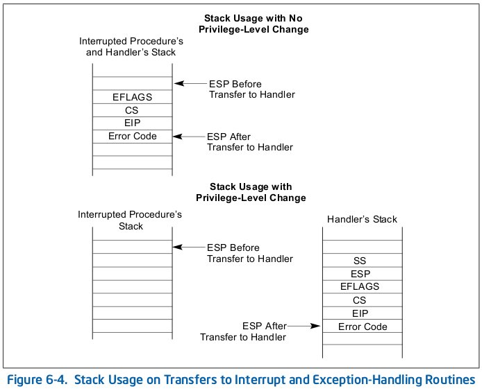

Projecto 2: procesos de usuario
===============================

---

Resumen:
========

* Motivación
* Por arriba
* Que hay que completar
* Como seguimos (entrega intermedia, 2 clases más)
* Material de Lectura

---

Motivación: ¿Qué necesito para tener procesos de usuario?
=============================================

---

Necesito
--------

* **Protección** (kernel vs. user).
* Definir un **layout** para la memoria de usuario y poner allí los pedazos del ELF.
* Aumentar los `kthread` con **información de procesos de usuarios**.
* Definir la interface de inicio del proceso: **`int main(argc,argv)`**.
* Definir la interface de comunicación del proceso con el kernel: **syscalls**.
* **Lanzar** el proceso.
* **Cambiar el mapa de memoria** cuando cambia el ctxt a un proceso de usuario.

---

Por arriba
==========

---

Protección
==========

* Estamos en modo protegido, luego hay segmentación.
* Diferenciar **Logical** address vs. **Linear** address.
    * process vs. kernel memory.
* Definir una `LDT` con los segmentos básicos para correr el proceso usuario.
    * Segmento de **datos**, segmento de **código**.

---

Layout de memoria
=================

Hay que usar el ELF y `argc, argv` para definir el layout

* Definir tamaño de la imagen de memoria.
* Copiar los segmentos ELF.
* Copiar `argc, argv` en algún lugar de la memoria.
* Dejar espacio para el stack.
* ¿Y el heap? ¿Cuánta memoria dejamos para alocación dinámica? (`brk()`)

---

Contexto de Usuario
===================

El hilo de kernel que manejará el proceso de usuario tiene información extra.

* Memory layout.
    * LDT
    * Selectores
* Tamaño de la imagen de memoria.
* Punto de entrada.
* Ubicación de `argc, argv`.

---

Lanzar el proceso
=================

Dejar todo como si lo hubieran interrumpido en el punto de entrada y encolarlo.

---

Cambiar de contexto
===================

Cambiar el memory layout, o sea la segmenación.

---

Que hay que completar
=====================

---

Crear un proceso
================

Crea y lanza un proceso de usuario a partir de:

* Un path en el FS que apunta a un ELF
* Una lista de argumentos.

`Spawn()`:

* `Read_Fully()` : lista
* `Parse_ELF_Executable()` : proyecto 1
* `userseg.c:Load_User_Program()` : **completar**
* `kthread.c:Start_User_Thread()` : **completar**

---

Cargar el programa en memoria
=============================

`userseg.c:Load_User_Program()`

* Establece el tamaño de la imagen que contendrá el proceso.
* **Crea el contexto de usuario dentro del kthread**.
* Copia los segmentos ELF a la memoria.
* Copia los argumentos a la memoria.
* (probablemente) Resetea pedazos de memoria.
* Termina de cargar el contexto de usuario.

---

Crear contexto de usuario
=========================

Aumentar `struct Kernel_Thread` con el contexto de usuario: `struct User_Context`

Rellenar `{Create,Destroy}_User_Context()`.

En la creación del contexto:

* Crea la memoria del proceso.
* Definir la `LDT` correspondiente:
    * Delicado
    * Entender bien segmentación en ia32.
    * Las [filminas CMSC 412, 2005](http://www.cs.umd.edu/class/spring2005/cmsc412/proj2/proj2.ppt) son muy valiosas.

En la próxima clase vamos a hablar de **Segmentación en ia32**, para que este punto quede más claro.

---

Lanzar el proceso
=================

Hay que llenar `Start_User_Thread()`.

La complejidad está en `Setup_User_Thread()`:

* Dejar todo como si lo hubieran interrumpido (stack).
* Ver `int.h:struct Interrupt_State` para ver cual es el formato que se espera en el stack.
* Poner en cada campo el valor que se espera, ej: en el `EIP` la `struct Exe_Format.entryAddr`.

---

Asi deja el ia32 el stack luego de una interrupción:

---

Cambio de contexto
==================

Todo está hecho salvo la parte donde *cambia la imagen de memoria*.

`userseg.c:Switch_To_Address_Space()`:

* `lldt` con el selector de la LDT que le corresponde a ese proceso.
* inline assembler!

---

Recuerden
=========

* Hasta que no completen todos los `TODO()`, no van a tener **nada** funcionando.
* Hay que agregar pocas líneas (100?), asi que programen de manera muy cuidadosa.
* Debuggear es penoso:
    * Escriban código sencillo.
    * Usen `KASSERT` para todas las condiciones que están suponiendo.
    * De última `Print()` puede ser de utilidad.

---

Como pruebo
===========

Cambiar `main.c:INIT_PROGRAM` para lanzar `null.exe`.

    !c
    /*
     * A test program for GeekOS user mode
     */

    #include <process.h>

    int main(int argc, char** argv)
    {
      Null();
      for(;;);
      return 0;
    }

---

Como pruebo más cosas
=====================

**No** se debería poder desde userspace:

* Llamar a interrupciones que no sean la `INT90`.
* Ejecutar instrucciones protegidas como in y outs a puertos o `lgdt` :) .
* Escribir en el código.
* Irme de los límites tanto en datos como en código.

---

Como seguimos
===================

---

Planes para las 3 semanas
=========================

* El proyecto se divide en dos partes:
    * Hacer funcionar `/c/null.exe` (2 semanas).
    * Implementar el resto de los syscalls para que funcione `/c/shell.exe` (1 semana).
* Clase 2: **ia32 segmentation**.
* Clase 3: **syscall ifce**.

---

Material de Lectura
===================

---

Imprescindibles
===================

* "*GeekOS Hacking Guide*" (aunque no dice mucho).
* Proyecto de [CMSC 412](http://www.cs.umd.edu/class/spring2005/cmsc412/proj2/), 2005.
* Las [filminas](http://www.cs.umd.edu/class/spring2005/cmsc412/proj2/proj2.ppt) con más información.
* *Intel® 64 and IA-32 Architectures Software Developer's Manual Volume 3A: System Programming Guide*, [Part 1, Chapter 3](http://www.intel.com/Assets/PDF/manual/253668.pdf).

Recomendados
============

* Tom Shanley, *Protected Mode Software Architecture*, Mindshare, 1996.

